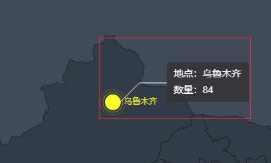
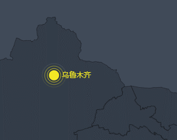
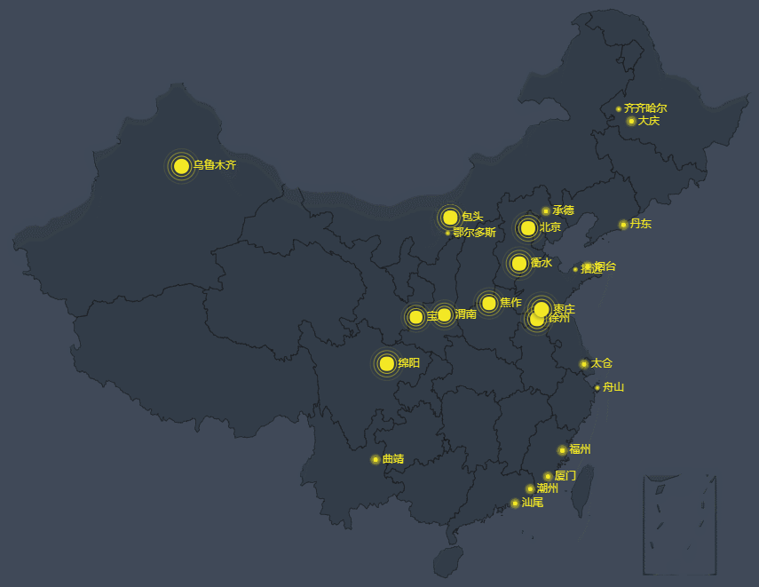

# 自制带引导线的echart tooltip
[链接](https://mying666.github.io/myEcTooltip/index)

## 效果图
=====>


## 配置项

``` 配置项
config = {
    priority: 'top',        // 默认在点上方OR下方（top/bottom）
    partition: 1.4,         // 左右分割比例
    lineColor: '#fff',      // 引导线颜色
    offset: [5, 5],
    L1: {
        time: 0.3,          // L1动画时长(单位s)
        long: 40            // L1长度
    },
    L2: {
        time: 0.3,
        long: 40
    },
    text: {
        time: 0.5,
        font: '14px Arial',
        color: '#fff',
        padding: [10, 10],
        width: 120,
        height: 60,
        lineHeight: 24,
        backgroundColor: 'rgba(50, 50, 50, 0.8)'
    }
}
```
## 依赖
> [createJS](https://code.createjs.com/1.0.0/easeljs.min.js)
[TweenMax](https://cdnjs.cloudflare.com/ajax/libs/gsap/2.0.1/TweenMax.min.js)
[lodash](https://cdn.bootcss.com/lodash.js/4.17.11/lodash.min.js)

## 使用方法
* 引入myToolip.js
* 实例化EC对象
* 创建myTooltip对象 
* 配置ECoption，跟正常使用EC一样。只在tooltip项的positon和formatter稍作改动
```
tooltip: {
    trigger: 'item',
    triggerOn: 'click',
    backgroundColor: 'transparent',
    position (pos) {
        let position = myTooltip.getPosOrSize('pos', pos)
        return position
    },
    formatter (params) {
        let text = `地点：${params.name}\n数量：${params.value[2]}`
        let tooltipDom = myTooltip.getTooltipDom(text)
        return tooltipDom
    }
}
```
